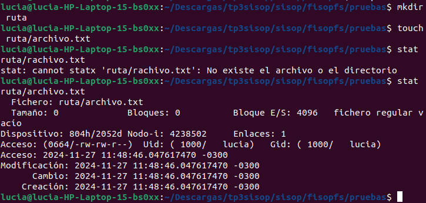
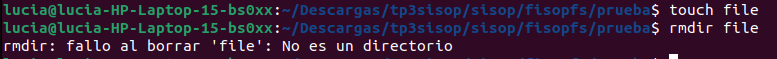
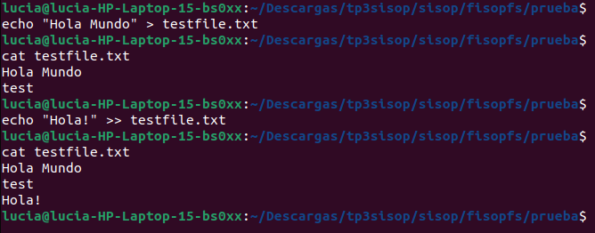
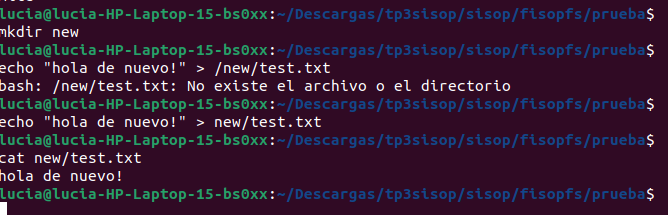
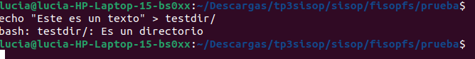

# fisop-fs

Lugar para respuestas en prosa y documentación del TP.

### fisopfs_read:

```
/prueba$ mkdir hola
/prueba$ touch hola/hola.txt
/prueba$ echo "Hola!" > hola/hola.txt
/prueba$ echo "Chau!" >> hola/hola.txt
/prueba$ cat hola/hola.txt
Hola!
Chau!
/prueba$ head -n 1 hola/hola.txt
Hola!
```

### fisopfs_truncate:

```
/prueba$ touch hola.txt
/prueba$ echo "Hola! ¿Cómo estas?" > hola.txt
/prueba$ ls -lh hola.txt
-rw-r--r-- 1 usuario usuario 21 nov 26 00:52 hola.txt
/prueba$ truncate -s 10 hola.txt
/prueba$ ls -lh hola.txt
-rw-r--r-- 1 usuario usuario 10 nov 26 00:53 hola.txt
```

### fisops_create

```
/prueba$ touch hola.txt
/prueba$ ls
hola.txt
```

### fisops_destroy

Primero, montar sobre la terminal como se indico previamente. Luego se puede modificar, crear o eliminar archivos con comandos como cat,touch,echo. Ejemplo, estando sobre el directorio prueba: 'touch mnt/test_destroy.txt' 'touch mnt/test_destroy.txt' o 'cat mnt/test_destroy' entre otros. Luego se debe desmontar siguiendo el comando 'sudo umount prueba'


### fisops_getattr

```
/prueba$ mkdir ruta
/prueba$ touch ruta/archivo.txt
/prueba$stat ruta/rachivo.txt
stat ruta/rachivo.txt
stat: cannot statx 'ruta/rachivo.txt': No existe el archivo o el directorio
/prueba$ stat ruta/archivo.txt
Fichero: ruta/archivo.txt
  Tamaño: 0         	Bloques: 0          Bloque E/S: 4096   fichero regular vacío
Dispositivo: 804h/2052d	Nodo-i: 4238502     Enlaces: 1
Acceso: (0664/-rw-rw-r--)  Uid: ( 1000/   lucia)   Gid: ( 1000/   lucia)
Acceso: 2024-11-27 11:48:46.047617470 -0300
Modificación: 2024-11-27 11:48:46.047617470 -0300
      Cambio: 2024-11-27 11:48:46.047617470 -0300
    Creación: 2024-11-27 11:48:46.047617470 -0300

```



### fisops_rmdir
Prueba simple para ver que se elimina el directorio:
```
/prueba$ mkdir testdir
/prueba$ rmdir testdir
/prueba$ ls
/prueba$ 
```


Prueba para ver que sucede si no existe el directorio:
```
/prueba$ rmdir /noneexistent
rmdir: fallo al borrar '/noneexistent': No existe el archivo o el directorio 
```


Prueba donde se intenta eliminar un archivo y no un directorio:
```

/prueba$ touch file
/prueba$ rmdir file
rmdir: fallo al borrar 'file': No es un directorio
```



Prueba donde se intenta eliminar un directorio no vacio:
```
/prueba$ mkdir noneemptydir
/prueba$ touch noneemptydir/file.txt
/prueba$ rmdir noneemptydir
rmdir: fallo al borrar 'noneemptydir': El directorio no esta vacio
```


### fisops_write
Prueba simple donde se intenta escribir un archivo
```
/prueba$ echo 'Este es un test' > testfile.txt
/prueba$ cat testfile.txt
Este es un test
```


Luego intentamos escribir en un archivo ya creado mas cosas en el directorio, al principio y al final:
```
/prueba$ echo 'test' > testfile.txt
/prueba$ echo "Hola Mundo" > testfile.txt
/prueba$ cat testfile.txt
Hola Mundo
test
/prueba$ echo "Hola!" >> testfile.txt
/prueba$cat testfile.txt
Hola Mundo
test
Hola!
```



En esta prueba se intenta escribir un archivo en otro directorio:
```
/prueba$ mkdir new
/prueba$ echo "hola de nuevo" > /new/test.txt
bash: /new/test.txt: NO existe el archivo o el directorio
/prueba$ echo "hola de nuevo" > new/test.txt
/prueba$ cat new/test.txt
hola de nuevo
```



En esta prueba se intenta escribir en algo que no es un archivo:
```
/prueba$ echo "Este es un texto" > testdir/
bash: testdir/: Es un directorio
```

### fisopfs_readdir


### fisopfs_unlink

